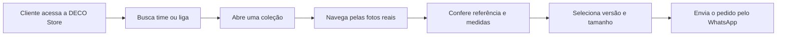

# DECO Store

> Catálogo digital de camisas de futebol sob encomenda, com fotos reais, atendimento pelo WhatsApp e conta com confirmação por e-mail.

## Visão Geral

A DECO Store é uma vitrine de camisas de futebol feita para venda sob encomenda. O cliente consulta o catálogo, navega pelas fotos reais, escolhe tamanho e versão, e envia a referência pelo WhatsApp com a mensagem já montada.

O catálogo usa o material recebido no arquivo original. Quando uma foto veio sem nome confiável, o app mostra **Referência do catálogo** em vez de inventar modelo, temporada ou preço. Quando o valor não consta no material, o site exibe **Consultar via WhatsApp**.

## Destaques

| Área | Funcionamento atual |
| --- | --- |
| Catálogo | 17 clubes organizados por liga, com 202 fotos reais. |
| Fotos | Cards com carrossel, setas e miniaturas quando existe mais de uma imagem. |
| Busca | Pesquisa por time ou liga, com Enter, clique na lupa e busca sem depender de acentos. |
| Pedido | WhatsApp com time, liga, referência da foto, arquivo original, versão e tamanho. |
| Medidas | Guia base de P a 3G para o cliente comparar com uma camisa que já veste bem. |
| Conta | Cadastro, login, confirmação por e-mail, recuperação de senha e logout. |
| Prazo | Informação do catálogo: **20 a 40 dias**. |
| Contato | WhatsApp: **(61) 99891-2720**. |

## Fluxo do Cliente

## Catálogo

As fotos ficam em `public/catalog` e os dados ficam em `lib/catalog-data.ts`.

| Liga | Clubes no catálogo |
| --- | --- |
| Brasileirão Série A | Flamengo, Palmeiras, Corinthians, Santos, São Paulo, Cruzeiro, Atlético Mineiro, Vasco, Bahia, Fluminense e Internacional. |
| Bundesliga | Bayer Leverkusen, Bayern Munich, Borussia Dortmund, RB Leipzig e Schalke 04. |
| La Liga | Real Madrid. |

### Referência das Fotos

O app usa duas formas de identificação:

- nome original da foto, quando o arquivo veio com um nome legível;
- **Referência do catálogo X**, quando a foto veio com código, hash ou nome genérico.

Essa regra mantém o catálogo honesto: o cliente consegue apontar exatamente a foto desejada, e o atendimento recebe o arquivo original na mensagem do WhatsApp.

## Guia de Medidas

As medidas exibidas no modal da camisa são uma base de referência para ajudar no pedido. Elas são apresentadas com a peça aberta:

| Tamanho | Peito | Comprimento | Altura sugerida |
| --- | --- | --- | --- |
| P | 50 cm | 69 cm | 1,60 a 1,70 m |
| M | 52 cm | 71 cm | 1,68 a 1,78 m |
| G | 55 cm | 74 cm | 1,75 a 1,85 m |
| GG | 58 cm | 77 cm | 1,82 a 1,92 m |
| 3G | 61 cm | 80 cm | 1,88 a 2,00 m |

A orientação do app é comparar essas medidas com uma camisa que já veste bem antes de fechar o pedido.

## Conta e E-mails

A área de conta usa Better Auth com Neon PostgreSQL e envio de e-mail pelo Resend.

Fluxos disponíveis:

- cadastro com nome, e-mail e senha;
- confirmação de e-mail no cadastro;
- bloqueio de login antes da confirmação;
- reenvio de confirmação;
- recuperação de senha por e-mail;
- fechamento automático do menu após login;
- visualização de nome, e-mail confirmado e opção de sair.

Os e-mails transacionais usam a marca **DECO** no assunto e no corpo.

## Variáveis de Ambiente

| Variável | Uso |
| --- | --- |
| `DATABASE_URL` | Conexão PostgreSQL do Neon. |
| `BETTER_AUTH_URL` | URL base do ambiente, como `http://localhost:3000` ou a URL final da Vercel. |
| `BETTER_AUTH_SECRET` | Segredo fixo de autenticação, com pelo menos 32 caracteres. |
| `RESEND_API_KEY` | Chave de envio de e-mails pelo Resend. |
| `EMAIL_FROM` | Remetente dos e-mails, como `DECO <conta@seu-dominio.com.br>`. |

O arquivo `.env.example` mantém o formato das variáveis sem credenciais reais. O `.env` local permanece fora do Git.

## Estrutura Principal

| Caminho | Função |
| --- | --- |
| `app/page.tsx` | Entrada da home. |
| `components/catalog-storefront.tsx` | Vitrine, busca, carrossel, modal, guia de medidas e WhatsApp. |
| `lib/catalog-data.ts` | Dados das coleções, fotos, contato e instruções de pedido. |
| `public/catalog` | Fotos reais copiadas do catálogo. |
| `components/account-menu.tsx` | Modal de login, cadastro, confirmação, recuperação e logout. |
| `lib/auth-*` | Configuração da autenticação e envio de e-mail. |
| `database/schema.sql` | Estrutura do Neon para usuários, sessões, verificações, limites e pedidos. |
| `tests/auth.test.ts` | Testes dos fluxos de autenticação e e-mail. |

## Estado Atual

Implementado:

- catálogo real com 202 fotos;
- busca funcional por time ou liga;
- carrossel por coleção;
- modal com miniaturas;
- referência da foto selecionada;
- guia de medidas de P a 3G;
- seleção de versão e tamanho;
- envio do pedido para WhatsApp;
- cadastro e login com confirmação por e-mail;
- recuperação de senha;
- layout responsivo.

Dependências externas da operação:

- valor final de cada camisa;
- confirmação manual pelo WhatsApp;
- pagamento;
- envio e rastreio.
