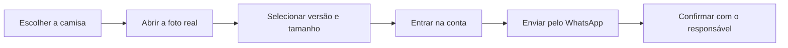

# ⚽ DECO Store

> Catálogo digital de camisas de futebol sob encomenda, com fotos reais, conta de cliente, confirmação por e-mail e pedido enviado pelo WhatsApp.

---

## 🧾 Sobre o projeto

A **DECO Store** é uma vitrine de camisas de futebol feita para venda **sob encomenda**.

O cliente acessa o catálogo, pesquisa por time ou liga, abre a camisa desejada, visualiza as fotos reais, escolhe tamanho e versão, faz login na conta e envia o pedido pelo WhatsApp com a mensagem já preenchida.

O app não usa imagens genéricas para representar os produtos. As fotos exibidas vêm do catálogo recebido e ficam organizadas por clube, liga e referência.

---

## ✨ Principais recursos

| Recurso | Como funciona |
| --- | --- |
| 🖼️ Catálogo real | 17 clubes e 202 fotos reais organizadas por liga. |
| 🔎 Busca | Pesquisa por time ou liga, funcionando com Enter, clique na lupa e sem depender de acentos. |
| 🏷️ Referência da foto | Cada imagem tem uma referência para facilitar o atendimento pelo WhatsApp. |
| 🖱️ Hover nas camisas | Cards e imagens principais ganham efeito de aproximação ao passar o mouse. |
| 🔍 Zoom da foto | No modal, a imagem pode ser ampliada e o foco acompanha mouse ou toque no celular. |
| 🧩 Miniaturas | Quando há várias fotos, o cliente navega por miniaturas organizadas. |
| 📏 Guia de medidas | Tabela de P a 3G para ajudar o cliente a escolher o tamanho. |
| 👤 Conta do cliente | Cadastro, login, confirmação de e-mail, recuperação de senha e logout. |
| 🔐 Pedido com login | O cliente só consegue enviar pedido pelo WhatsApp depois de entrar na conta. |
| 🔔 Avisos visuais | Login, saída da conta e bloqueio de pedido aparecem no topo direito por 4 segundos. |
| 💬 WhatsApp | Pedido enviado com time, liga, foto, arquivo, versão, tamanho e valor. |

---

## 🛒 Como o pedido funciona

A seção **Como pedir** foi organizada em etapas simples para o cliente entender o processo rapidamente.

### Etapas no site

1. 🔎 Escolher a camisa e o tamanho no catálogo.
2. 💬 Chamar no WhatsApp com a referência da foto.
3. 👕 Informar versão torcedor, jogador ou personalizada.
4. ✅ Confirmar pagamento e endereço de entrega.
5. 📦 Acompanhar o rastreio até a chegada.

---

## 💰 Valores padrão

| Versão | Valor | Detalhe |
| --- | ---: | --- |
| Torcedor | R$ 160,00 | Versão padrão. |
| Jogador | R$ 200,00 | Versão jogador. |
| Personalizada | R$ 220,00 | Nome atrás e todos os patrocinadores. |

---

## 📏 Guia de medidas

As medidas são exibidas no modal da camisa como base para comparação com uma camisa que já veste bem.

| Tamanho | Peito | Comprimento | Altura sugerida |
| --- | --- | --- | --- |
| P | 50 cm | 69 cm | 1,60 a 1,70 m |
| M | 52 cm | 71 cm | 1,68 a 1,78 m |
| G | 55 cm | 74 cm | 1,75 a 1,85 m |
| GG | 58 cm | 77 cm | 1,82 a 1,92 m |
| 3G | 61 cm | 80 cm | 1,88 a 2,00 m |

> As medidas são aproximadas. O ideal é comparar com uma camisa aberta que já tenha bom caimento.

---

## 🏆 Catálogo atual

| Liga | Clubes disponíveis |
| --- | --- |
| Brasileirão Série A | Flamengo, Palmeiras, Corinthians, Santos, São Paulo, Cruzeiro, Atlético Mineiro, Vasco, Bahia, Fluminense e Internacional. |
| Bundesliga | Bayer Leverkusen, Bayern Munich, Borussia Dortmund, RB Leipzig e Schalke 04. |
| La Liga | Real Madrid. |

### Como as fotos são identificadas

O app usa a identificação mais segura possível para cada imagem:

- quando o arquivo tem nome claro, a foto usa essa referência;
- quando o arquivo tem nome genérico, código ou hash, o app usa **Referência do catálogo X**;
- o WhatsApp recebe também o arquivo original da imagem escolhida.

Isso evita inventar modelo, temporada ou versão quando essa informação não veio no catálogo.

---

## 👤 Área da conta

A conta do cliente foi criada para proteger o fluxo de pedido e permitir confirmação por e-mail.

Fluxos disponíveis:

- cadastro com nome, e-mail e senha;
- confirmação de e-mail;
- login com conta confirmada;
- recuperação de senha;
- logout;
- fechamento automático do menu após login;
- mensagem de login no topo direito;
- mensagem de saída no topo direito;
- bloqueio de pedido para quem não estiver logado.

Os e-mails transacionais usam a marca **DECO**.

---

## 💬 Atendimento

O contato principal do site é feito pelo WhatsApp.

| Item | Informação |
| --- | --- |
| Responsável | Atendimento da DECO Store |
| WhatsApp | Botão direto no site |
| Prazo informado | 20 a 40 dias |
| Tipo de venda | Somente por encomenda |

No rodapé, o cliente encontra um botão com ícone do WhatsApp para falar com o responsável, sem exibir o número como texto solto.

---

## 🎨 Interface atual

A página foi organizada para ficar simples de entender e visualmente consistente.

| Área | Ajuste visual |
| --- | --- |
| Topo | Menu fixo com links para catálogo, como pedir e WhatsApp. |
| Hero | Duas camisas em destaque com efeito individual ao passar o mouse. |
| Como pedir | Bloco compacto com etapas, ícones e cores leves. |
| Catálogo | Cards com hover, carrossel, busca e filtros. |
| Modal da camisa | Fotos, miniaturas, zoom móvel, tamanho, versão, medidas e pedido. |
| Footer | Blocos organizados com resumo, atendimento e valores. |

---

## 🔐 Variáveis de ambiente

Essas variáveis são necessárias para o app funcionar com autenticação, banco e envio de e-mail.

| Variável | Onde usar | Função |
| --- | --- | --- |
| `DATABASE_URL` | `.env` e Vercel | Conexão PostgreSQL do Neon. |
| `BETTER_AUTH_URL` | `.env` e Vercel | URL base do app. Localmente usa `http://localhost:3000`; na Vercel usa a URL final do projeto. |
| `BETTER_AUTH_SECRET` | `.env` e Vercel | Segredo fixo da autenticação, com pelo menos 32 caracteres. |
| `RESEND_API_KEY` | `.env` e Vercel | Chave de envio de e-mails pelo Resend. |
| `EMAIL_FROM` | `.env` e Vercel | Remetente dos e-mails, como `DECO <conta@seudominio.com.br>`. |

O arquivo `.env.example` mantém apenas o formato das variáveis. O `.env` real deve ficar fora do Git.

---

## 🧱 Estrutura principal

| Caminho | Responsabilidade |
| --- | --- |
| `app/page.tsx` | Entrada da página inicial. |
| `components/catalog-storefront.tsx` | Vitrine, busca, cards, modal, zoom, medidas, pedido e footer. |
| `components/account-menu.tsx` | Login, cadastro, confirmação, recuperação de senha e logout. |
| `components/brand-logo.tsx` | Logo textual da DECO. |
| `lib/catalog-data.ts` | Dados das camisas, fotos, contato e instruções de pedido. |
| `lib/auth-client.ts` | Cliente de autenticação usado no navegador. |
| `lib/auth.ts` | Configuração da autenticação. |
| `lib/email.ts` | Envio dos e-mails transacionais. |
| `public/catalog` | Fotos reais do catálogo. |
| `database/schema.sql` | Estrutura do banco Neon. |

---

## ✅ Estado atual

Implementado no app:

- catálogo real com 17 clubes e 202 fotos;
- pesquisa por time ou liga;
- cards com efeito de aproximação;
- destaque visual nas camisas do topo;
- modal com carrossel e miniaturas;
- zoom móvel com mouse ou toque;
- guia de medidas;
- seleção de tamanho e versão;
- valores padrão por versão;
- login obrigatório para enviar pedido;
- avisos no topo direito por 4 segundos;
- pedido enviado para WhatsApp com dados preenchidos;
- cadastro com confirmação por e-mail;
- recuperação de senha;
- footer estruturado com atendimento, prazo e valores.
