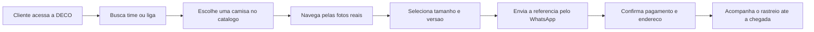

# DECO

> Catalogo digital de camisas de futebol sob encomenda, com fotos reais, contato direto pelo WhatsApp e conta com confirmacao por e-mail.


## Visao Geral

A DECO e uma vitrine de camisas de futebol feita para vender por encomenda. O cliente navega pelo catalogo, escolhe a foto de referencia, seleciona tamanho e versao, e envia o pedido pelo WhatsApp ja com a mensagem pronta.

O app foi ajustado para usar o material real do catalogo enviado, sem fotos genericas e sem valores inventados. Quando o catalogo nao informa preco, o site mostra **Consultar via WhatsApp**.

## Destaques

| Area | O que existe hoje |
| --- | --- |
| Catalogo | 17 clubes organizados por liga, com 202 fotos reais do catalogo. |
| Fotos | Cards com carrossel, setas e miniaturas quando existe mais de uma imagem. |
| Busca | Pesquisa por time ou liga, com suporte a Enter, clique na lupa e busca sem depender de acento. |
| Pedido | Botao de WhatsApp com time, liga, referencia da foto, arquivo original, versao e tamanho. |
| Conta | Cadastro, login, confirmacao por e-mail, recuperacao de senha e logout. |
| Prazo | Exibe o prazo informado no catalogo: **20 a 40 dias**. |
| Contato | WhatsApp principal: **(61) 99891-2720**. |

## Experiencia do Cliente



## Catalogo

O catalogo atual foi montado a partir do arquivo de imagens recebido. Ele esta estruturado por colecao/time, mantendo as fotos em `public/catalog` e os dados em `lib/catalog-data.ts`.

Quando a imagem veio com nome reconhecivel no arquivo original, o site mostra esse nome. Quando o arquivo veio como codigo ou hash, o site mostra **Referencia do catalogo X**. Essa escolha evita inventar modelo, temporada ou versao sem uma fonte confiavel.

Ligas e clubes presentes:

| Liga | Clubes |
| --- | --- |
| Brasileirao Serie A | Flamengo, Palmeiras, Corinthians, Santos, Sao Paulo, Cruzeiro, Atletico Mineiro, Vasco, Bahia, Fluminense e Internacional. |
| Bundesliga | Bayer Leverkusen, Bayern Munich, Borussia Dortmund, RB Leipzig e Schalke 04. |
| La Liga | Real Madrid. |

## Conta e E-mails

A area de conta usa Better Auth com banco Neon e envio de e-mail pelo Resend.

Fluxos implementados:

- criar conta com nome, e-mail e senha;
- enviar e-mail de confirmacao no cadastro;
- bloquear login ate o e-mail ser confirmado;
- reenviar confirmacao;
- recuperar senha por e-mail;
- fechar automaticamente o menu depois que o login entra;
- mostrar nome, e-mail confirmado e botao para sair da conta.

Os e-mails da loja usam a marca **DECO** no assunto e no corpo da mensagem.

## Variaveis de Ambiente

As mesmas variaveis devem existir no `.env` local e nas configuracoes da Vercel.

| Variavel | Local | Vercel |
| --- | --- | --- |
| `DATABASE_URL` | URL PostgreSQL do Neon. | URL do banco usado no ambiente publicado. |
| `BETTER_AUTH_URL` | `http://localhost:3000` | URL final do site, como `https://deco.vercel.app` ou dominio proprio. |
| `BETTER_AUTH_SECRET` | Segredo aleatorio de pelo menos 32 caracteres. | Segredo fixo e separado do ambiente local. |
| `RESEND_API_KEY` | Chave de API do Resend. | Chave de envio do Resend para producao. |
| `EMAIL_FROM` | `DECO <conta@seu-dominio.com.br>` | Mesmo remetente, sem aspas externas no painel da Vercel. |

Observacoes:

- nenhuma variavel de servidor deve usar `NEXT_PUBLIC_`;
- o arquivo `.env` fica fora do Git;
- o `.env.example` mostra o formato sem credenciais reais;
- se o remetente ainda estiver com o nome anterior na Vercel, os e-mails podem continuar saindo com a marca antiga.

## Estrutura Principal

| Caminho | Funcao |
| --- | --- |
| `app/page.tsx` | Entrada da home. Renderiza a vitrine principal. |
| `components/catalog-storefront.tsx` | Interface do catalogo, busca, carrossel, modal e WhatsApp. |
| `lib/catalog-data.ts` | Dados das colecoes, fotos, contato e instrucoes de pedido. |
| `public/catalog` | Fotos reais copiadas do catalogo enviado. |
| `components/account-menu.tsx` | Modal de login, cadastro, confirmacao, recuperacao e logout. |
| `lib/auth-*` | Configuracao do Better Auth, envio de e-mail e cliente de autenticacao. |
| `database/schema.sql` | Tabelas do Neon para pedidos, usuarios, sessoes e verificacoes. |
| `tests/auth.test.ts` | Testes dos fluxos de cadastro, confirmacao, login e recuperacao. |

## Estado Atual

Implementado:

- catalogo real com 202 fotos;
- busca funcional por texto;
- carrossel por colecao;
- modal com miniaturas;
- selecao de tamanho e versao;
- envio do pedido para WhatsApp;
- cadastro e login com confirmacao por e-mail;
- recuperacao de senha;
- layout responsivo.

Ainda depende de operacao externa:

- preco final de cada camisa;
- confirmacao manual pelo WhatsApp;
- pagamento;
- dados reais de envio/rastreio.

## GitHub

O repositorio remoto atual ainda esta com o nome antigo:

```txt
Victor-Hugo-A/kitora-football-store
```

Da para mudar para `deco` no GitHub. O jeito mais simples e:

1. abrir o repositorio no GitHub;
2. acessar **Settings**;
3. em **Repository name**, trocar para `deco`;
4. clicar em **Rename**;
5. atualizar o remoto local depois da troca:

```bash
git remote set-url origin https://github.com/Victor-Hugo-A/deco.git
```

O GitHub costuma redirecionar o endereco antigo por um tempo, mas e melhor atualizar o remoto para evitar confusao em futuros `push`.
